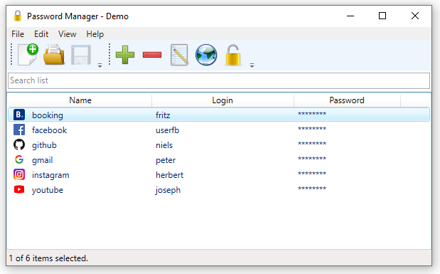
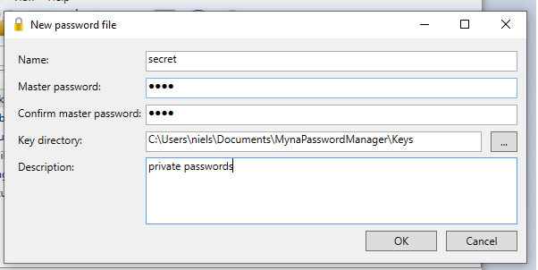
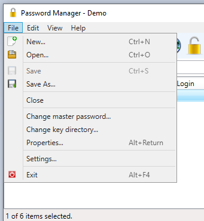
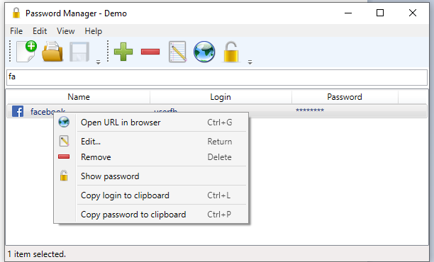

# Myna Password Manager

## Overview

A password manager for Windows using WPF.

## Installation

The program is published as ZIP file. Unpack the ZIP file and start MynaPasswordManager.exe.

The program requires .NET 8.

## Encryption

The passwords for each item are encrypted with the Rijndael algorithm using an encrypted key file.
Preferable the key file should be stored on a different device than the password file.
The key file is encrypted using the SHA-256 hash of the master password.
The process itself tries to keep the plain text passwords in memory as short as possible.

## Features

* Random password generator
* Copy login and password to clipboard and clear clipboard after 30 seconds
* Open website for login
* Shortcuts for most commands
* Thumbnails for login websites
* Secure password storage in encrypted files
* Change of master password and key file
* Available for German and English
* Cloud upload for websites based on (https://github.com/nylssoft/MynaAPIServer)

## Screenshots

### Create New Repository

### Menu Items

#### File Menu Item

#### Edit Menu Item

#### View Menu Item

#### Context Menu Item and Search Filter

### Add Password Entry

### Password Generator

### Settings

## Build

- Build with VS 2022

## Licenses

The following icons are used from the **Open Icon Library** (https://sourceforge.net/projects/openiconlibrary):

application-exit-5.png / nuovext2 / LGPL-2.1 
document-decrypt-3.png / oxygen / CC-BY-SA 3.0 or LGPL 
document-encrypt-3.png / oxygen / CC-BY-SA 3.0 or LGPL 
document-new-6.ico / oxygen / CC-BY-SA 3.0 or LGPL 
document-open-2.png / echo / CC-BY-SA-3.0 
document-properties-2.png / gnome / GPLv2 
document-save-7.png / nuovext2 / LGPL-2.1 
document-save-as-6.png / nuovext2 / LGPL-2.1 
edit.png / gimp / GPLv2 
edit-copy-7.png / famfamfam-silk / CC-BY-2.5 or CC-BY-3.0 
homepage.png / nuvola / LGPL-2.1 
key.png / famfamfam-silk / CC-BY-2.5 or CC-BY-3.0 
kgpg_info.png / nuvola / LGPL-2.1 
list-add-4.ico / oxygen / CC-BY-SA 3.0 or LGPL 
list-remove-4.ico / oxygen / CC-BY-SA 3.0 or LGPL

